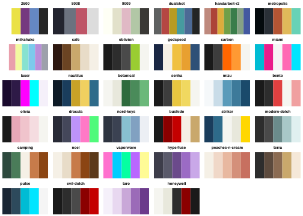
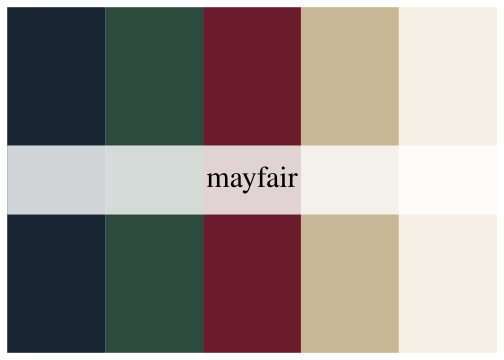
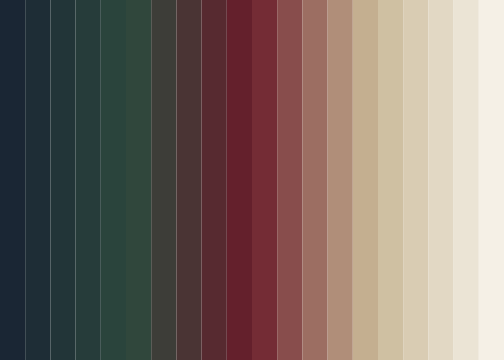
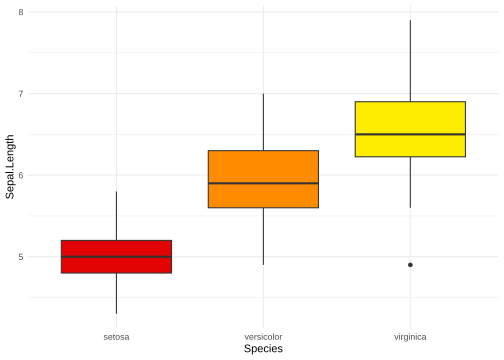
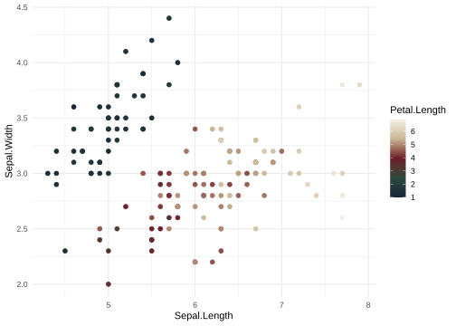
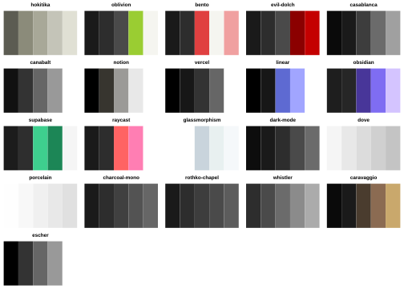

<!-- README.md is generated from README.qmd. Edit README.qmd. -->

# delphiPalettes

<!-- badges: start -->

[](https://github.com/ConnorB/delphiPalettes/actions/workflows/R-CMD-check.yaml)
[](https://app.codecov.io/gh/ConnorB/delphiPalettes)
<!-- badges: end -->

delphiPalettes provides 284 color palettes from the
[delphi.tools](https://delphi.tools) [palette
collection](https://delphi.tools/tools/palette-collection).

## Installation

Install the development version from
[GitHub](https://github.com/ConnorB/delphiPalettes).

Load the package.

``` r
# install.packages("pak")
pak::pak("ConnorB/delphiPalettes")
```

``` r
library(delphiPalettes)
```

## Browse palettes

`print_delphi_palettes()` draws one panel for each palette. Set
`category` or `colorblind_friendly = TRUE` to limit the result.

<!-- The raw HTML `alt` attribute supplies the alt text. The Quarto GFM
     renderer does not connect `fig-alt` to this attribute:
     https://github.com/quarto-dev/quarto-cli/issues/12456 -->

``` r
print_delphi_palettes("keycaps")
```



The `keycaps` category has 34 palettes. The collection has 284 palettes
in ten categories. With no filters, `print_delphi_palettes()` draws one
page per category.

## Get palette colors

Each palette name uses lowercase letters and hyphens. For example, use
`"mayfair"` or `"grand-budapest"`. `delphi_palette()` returns a
character vector of hexadecimal colors.

``` r
delphi_palette("mayfair")
#> [1] "#1a2634" "#2d4a3e" "#6b1c2a" "#c9b896" "#f5f0e6"
```

`print_delphi_palette()` draws the palette.

``` r
print_delphi_palette("mayfair")
```



Set `direction = -1` to reverse the color order. Set `n` to return the
first colors in the selected order.

``` r
delphi_palette("grand-budapest", direction = -1)
#> [1] "#f0c040" "#7b2d5b" "#f5e6d3" "#9c4070" "#d4658f"
delphi_palette("pride", n = 3)
#> [1] "#e40303" "#ff8c00" "#ffed00"
```

Set `type = "continuous"` to interpolate a palette. You must also set
`n`.

``` r
continuous <- delphi_palette("mayfair", n = 20, type = "continuous")
continuous
#>  [1] "#1A2634" "#1E2D36" "#223538" "#263C3A" "#2A443C" "#30473C" "#3D3D38"
#>  [8] "#4A3434" "#572A30" "#64202C" "#742C35" "#884D4C" "#9C6E62" "#B08E79"
#> [15] "#C4AF90" "#CFC0A2" "#D9CCB3" "#E2D8C4" "#EBE4D5" "#F5F0E6"
```



### Use with ggplot2

`scale_color_delphi_d()` and `scale_fill_delphi_d()` map factor levels
to palette colors. If a factor has more levels than colors, these scales
interpolate colors. `scale_color_delphi_c()` and `scale_fill_delphi_c()`
map numeric values to palette colors. `scale_colour_delphi_d()` and
`scale_colour_delphi_c()` use British spelling.

``` r
library(ggplot2)

ggplot(iris, aes(Species, Sepal.Length, fill = Species)) +
  geom_boxplot() +
  scale_fill_delphi_d("pride") +
  theme_minimal() +
  theme(legend.position = "none")
```



``` r
ggplot(iris, aes(Sepal.Length, Sepal.Width, color = Petal.Length)) +
  geom_point(size = 2) +
  scale_color_delphi_c("mayfair") +
  theme_minimal()
```



### Categories

The collection has ten categories: `classic`, `nature`, `keycaps`,
`vintage`, `modern`, `bold`, `soft`, `monochrome`, `seasonal`, and
`artistic`. Use `delphi_palettes()` to get one category.

``` r
names(delphi_palettes("keycaps"))
#>  [1] "2600"            "8008"            "9009"            "dualshot"       
#>  [5] "handarbeit-r2"   "metropolis"      "milkshake"       "cafe"           
#>  [9] "oblivion"        "godspeed"        "carbon"          "miami"          
#> [13] "laser"           "nautilus"        "botanical"       "serika"         
#> [17] "mizu"            "bento"           "olivia"          "dracula"        
#> [21] "nord-keys"       "bushido"         "striker"         "modern-dolch"   
#> [25] "camping"         "noel"            "vaporwave"       "hyperfuse"      
#> [29] "peaches-n-cream" "terra"           "pulse"           "evil-dolch"     
#> [33] "taro"            "honeywell"
```

### Color vision support

`{colorblindcheck}` simulates deuteranopia, protanopia, and tritanopia.
`delphi_palette_colorblind()` reports the stored result for one palette.
`delphi_palettes()` returns the 21 palettes that pass all three
simulations.

``` r
delphi_palette_colorblind("dove")
#> [1] TRUE
delphi_palette_colorblind("pinata")
#> [1] FALSE
```

``` r
print_delphi_palettes(colorblind_friendly = TRUE)
```



## Credits

[delphi.tools](https://delphi.tools) created the palette collection.
Ruby Morgan Voigt created the palette designs. delphiPalettes makes
these palettes available in R.
[delphitools](https://github.com/1612elphi/delphitools) uses the MIT
license. [LICENSE.md](LICENSE.md) includes its license notice.
